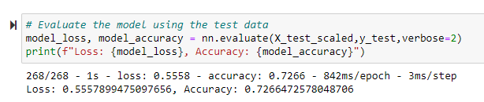
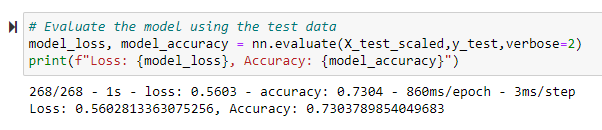
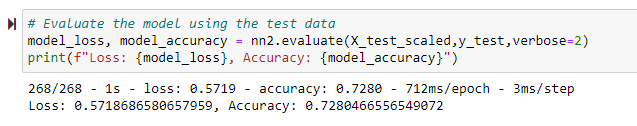
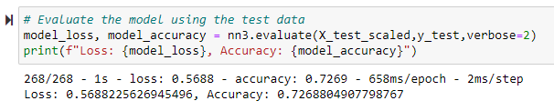

# Deep-Learning-Challenge
This repository is for the Data Analytics Bootcamp Module 21 Challenge-Neural Networks &amp; Deep Learning

## Overview of the Analysis
The nonprofit foundation Alphabet Soup wants a tool that can help it select the applicants for funding with the best chance of success in their ventures. I used the features in the dataset to create a binary classifier that can predict whether applicants will be successful if funded by Alphabet Soup.
The CSV used for this project contains more than 34,000 organizations that have received funding from Alphabet Soup over the years. Within this dataset are a number of columns that capture metadata about each organization, such as:

* **EIN** and **NAME**—Identification columns
* **APPLICATION_TYPE**—Alphabet Soup application type
* **AFFILIATION**—Affiliated sector of industry
* **CLASSIFICATION**—Government organization classification
* **USE_CASE**—Use case for funding
* **ORGANIZATION**—Organization type
* **STATUS**—Active status
* **INCOME_AMT**—Income classification
* **SPECIAL_CONSIDERATIONS**—Special considerations for application
* **ASK_AMT**—Funding amount requested
* **IS_SUCCESSFUL**—Was the money used effectively

## Results

* Data Preprocessing
  * The target of this model is the **IS_SUCCESSFUL** column since the model is attempting to predict the success of future ventures.
  * The features of this model include most of the rest of the columns in the dataset. The **APPLICATION_TYPE** and **CLASSIFICATION** columns were binned in an effort to reduce outlier skewing, and the dataset was scaled to ensure that the feature weights were determined correctly.
  * I removed both the **EIN** and **NAME** columns from this model since they both contain identification-only information.

* Compiling, Training, and Evaluating the Model
  * My initial model contained an initial layer, 2 hidden layers, and an output layer.
     * Initial layer: 43 neurons (same as the input dimensions) and ReLU activiation function
     * Hidden layers: 43 neurons and ReLU activiation function
     * Output layer: 1 neuron and Sigmoid activiation function
  * The first attempt returned 72.66% accuracy, prompting me to adjust the hyperparameters and dataset to attempt higher accuracy scores
  * For the second attempt, I increased the number of hidden layers from 2 to 4-this returned 73.03% accuracy
  * For the third attempt, I increased the bin thresholds to try and cut down outliers-this returned 72.80% accuracy
  * For the fourth attempt, I dropped the **INCOME_AMT** column and increased the number of epochs-this returned 72.68% accuracy

* First Attempt

 
* Second Attempt

* Third Attempt

* Fourth Attempt

## Summary
I was unable to make much of an impact on this model's accuracy score. I believe that continuing to preprocess the data and adjusting the hyperparameters could yield more effective results. This model would need additional testing before the charity would be able to deploy it moving forward. I think it would be beneficial to do more statistical testing to determine the impact that each feature has on the dataset as a whole.
